# Schema

The relational schema backing the whole SmartRetail AI platform — 31 tables,
defined as SQLAlchemy 2.0 ORM models (`apps/backend/app/models/`), deployed with
Alembic (`database/migrations/`), demo-seeded by `database/seeds/seed.py`.

## Design Principles

- **Store-scoped by default.** Multi-store support (§51) means nearly every
  business table carries a `store_id` (FK → `stores`, `ON DELETE RESTRICT`). On
  high-volume fact tables (`tracks`, `events`, `product_detections`,
  `product_states`, `risk_scores`, `alerts`, `evidence`, `journeys`,
  `journey_events`, `event_graph`, `track_frames`, `camera_handoffs`, `carts`,
  `shelves`, `shelf_products`, `pos_scans`, `incidents`, `incident_alerts`,
  `review_feedback`, `persons`) `store_id` is *denormalized* (repeated even
  though reachable via join) so dashboards filter on a single indexed column.
  Catalog/auth tables (`products`, `users`, `roles`, `permissions`) are global.
- **Lineage over deletion.** The §95 chain
  (alert → risk score → events → tracks → detections → frames) is preserved by
  nullable-but-traceable foreign keys: a row may be written before fusion
  resolves its links, but every populated key points at a real row.
- **Enum where the set is fixed, string where it is open.**
  PostgreSQL-native enums are used for bounded sets (statuses, zone/event
  graph-relationship types, product states, role codes, ...). *Open* vocabularies
  that grow every phase — `events.event_type`,
  `event_graph.relation_type` — are indexed strings, not enums, so adding a new
  event kind never requires a migration.
- **JSONB for flexible/evolving payloads.** Evidence, bounding boxes, zone
  polygons, per-signal breakdowns, and type-specific event data live in `jsonb`
  columns. Event payload shapes are versioned by
  `events.metadata_schema_version`.
- **Identifiers** are `bigint identity` PKs. Timestamps are `timestamptz`;
  `created_at`/`updated_at` default server-side to `now()`.

## Data Lineage Chain (§95)

```text
Alert
  └── risk_score_id ──────────────┐
RiskScore                          │ (nullable-safe)
  ├── event_id ──┐                 │
  │              ▼                 ▼
  │            Event ──► JourneyEvent ──► Journey
  │              │
  │              ├── camera_id ──► Camera
  │              ├── person_id ──► Person
  │              └── product_id ─► Product
  ├── journey_id ─► Journey
  └── person_id ──► Person
                         ▼
Tracks ─── camera_id ──► Camera
  ├── person_id ──► Person
  └── TrackFrame (bounding boxes)
          │
          ▼
ProductDetection ── camera_id / track_id / person_id / product_id
          │
          ▼
TrackFrame / Camera frames (evidence.storage_key → object storage)
```

Every hop can be walked in both directions; most hops are nullable at write
time and guaranteed-consistent once populated.

## Entity–Relationship Diagram

```mermaid
erDiagram
    STORES ||--o{ ZONES : "owns"
    STORES ||--o{ CAMERAS : "owns"
    STORES ||--o{ PERSONS : "scopes"
    STORES ||--o{ SHELVES : "owns"
    STORES ||--o{ CARTS : "scopes"
    STORES ||--o{ EVENTS : "scopes"
    STORES ||--o{ JOURNEYS : "scopes"
    STORES ||--o{ RISK_SCORES : "scopes"
    STORES ||--o{ ALERTS : "scopes"
    STORES ||--o{ INCIDENTS : "scopes"
    STORES ||--o{ POS_SCANS : "scopes"
    STORES ||--o{ AUDIT_LOGS : "optional scope"

    ZONES ||--o{ CAMERAS : "hosts"
    ZONES ||--o{ PERSONS : "current zone"
    ZONES ||--o{ CARTS : "located"
    ZONES ||--o{ SHELVES : "located"

    CAMERAS ||--o{ CAMERA_RELATIONSHIPS : "source"
    CAMERAS ||--o{ CAMERA_RELATIONSHIPS : "related"
    CAMERAS ||--o{ TRACKS : "captures"
    CAMERAS ||--o{ PRODUCT_DETECTIONS : "observes"
    CAMERAS ||--o{ EVENTS : "witnesses"
    CAMERAS ||--o{ CAMERA_HANDOFFS : "source/target"
    CAMERAS ||--o{ EVIDENCE : "frames"

    PRODUCTS ||--o{ PRODUCT_DETECTIONS : "resolved to"
    PRODUCTS ||--o{ PRODUCT_STATES : "state of"
    PRODUCTS ||--o{ SHELF_PRODUCTS : "expected on"
    PRODUCTS ||--o{ EVENTS : "subject"
    PRODUCTS ||--o{ JOURNEYS : "product journey"
    PRODUCTS ||--o{ POS_SCANS : "matched sku"

    PERSONS ||--o{ TRACKS : "fused identity"
    PERSONS ||--o{ PRODUCT_DETECTIONS : "associated"
    PERSONS ||--o{ PRODUCT_STATES : "actor"
    PERSONS ||--o{ EVENTS : "actor"
    PERSONS ||--o{ JOURNEYS : "person journey"
    PERSONS ||--o{ CAMERA_HANDOFFS : "resolved person"
    PERSONS ||--o{ CARTS : "owns"
    PERSONS ||--o{ RISK_SCORES : "subject"

    TRACKS ||--o{ TRACK_FRAMES : "frames"
    TRACKS ||--o{ CAMERA_HANDOFFS : "source"
    TRACKS ||--o{ CAMERA_HANDOFFS : "target"
    TRACKS ||--o{ PRODUCT_DETECTIONS : "context"
    TRACKS ||--o{ EVIDENCE : "track reference"

    PRODUCT_DETECTIONS ||--o{ PRODUCT_STATES : "transition anchor"
    PRODUCT_DETECTIONS ||--o{ EVIDENCE : "detection reference"

    JOURNEYS ||--o{ JOURNEY_EVENTS : "ordered events"
    EVENTS ||--o{ JOURNEY_EVENTS : "membership"
    EVENTS ||--o{ EVENT_GRAPH : "source"
    EVENTS ||--o{ EVENT_GRAPH : "target"
    EVENTS ||--o{ RISK_SCORES : "evaluated"

    JOURNEYS ||--o{ RISK_SCORES : "evaluated"
    RISK_SCORES ||--|| ALERTS : "materialized as"
    ALERTS ||--o{ EVIDENCE : "evidence"
    ALERTS ||--o{ INCIDENT_ALERTS : "bundled"
    ALERTS ||--o{ REVIEW_FEEDBACK : "reviewed"

    INCIDENTS ||--o{ INCIDENT_ALERTS : "bundles alerts"
    INCIDENTS ||--o{ EVIDENCE : "evidence"
    INCIDENTS ||--o{ REVIEW_FEEDBACK : "reviewed"

    USERS ||--o{ ALERTS : "assigned"
    USERS ||--o{ INCIDENTS : "created/assigned"
    USERS ||--o{ REVIEW_FEEDBACK : "author"
    USERS ||--o{ USER_ROLES : "has roles"
    ROLES ||--o{ USER_ROLES : "assigned"
    ROLES ||--o{ ROLE_PERMISSIONS : "grants"
    PERMISSIONS ||--o{ ROLE_PERMISSIONS : "granted"
    USERS ||--o{ AUDIT_LOGS : "actor"
```



## Table Catalog

### Store topology

| Table | Purpose | Role in lineage |
| ----- | ------- | --------------- |
| `stores` | A retail site (multi-store §51). Name, address, timezone, status. | Root scope; all store rows `ON DELETE RESTRICT`. |
| `zones` | Spatial regions (shelf, checkout, entrance, exit, restricted, ...). `bounds` = JSONB polygon in store-map coordinates. | Anchors cameras and current locations. |
| `cameras` | Full §6 camera metadata: name, location, zone, floor, RTSP, resolution, FPS, orientation, FOV, status (active/disabled/faulted), last heartbeat, GPU assignment. | Head of the visual lineage; every frame/track/event cites its camera. |
| `camera_relationships` | Self-M2M: `overlap`, `entry_exit`, `adjacent` (unique per pair+type). | Powers handoff candidates and blind-spot reasoning. |

### People & tracking

| Table | Purpose | Role in lineage |
| ----- | ------- | --------------- |
| `persons` | Session-scoped person identity within one visit (§53/§104). First/last seen, current zone, status. No biometric/identifying fields. | Target of fusion; person journeys hang here. |
| `tracks` | Single-camera tracking segment: camera, person (null until fusion), start/end, bbox summary, confidence, `track_key`. | Mid-chain link: event → track → detections. |
| `track_frames` | Per-frame bounding box + timestamp for a track (high volume, kept separate). | Leaf of the lineage chain (frame-level evidence). |
| `camera_handoffs` | Re-ID fusion link `source_track → target_track` with match confidence (Phase 8 fills this). | Multi-camera continuity. |

### Products, carts, shelves

| Table | Purpose | Role in lineage |
| ----- | ------- | --------------- |
| `products` | SKU-level catalog (global): sku, name, category, price, image ref. | Resolved product identity for detections/states/events. |
| `product_detections` | Observed product instance: camera, bbox, confidence, and (once resolved) product/person/track. | Anchors the product half of the lineage. |
| `product_states` | §19/§102 state machine (`normal → picked → carried → ...`). One row per *interval*: `entered_at`/`exited_at` makes the full history queryable, not just current state. | Per-product behavioral timeline. |
| `carts` | First-class cart/basket (§14): type, status, owning person, zone, seen times. | Object of interactions. |
| `shelves` | Physical shelf; `position` JSONB; links to its zone. | Baseline for shelf monitoring. |
| `shelf_products` | Expected product set + quantity per shelf. | Baseline for misplacement/discrepancy detection (Phase 16). |

### Events & journeys

| Table | Purpose | Role in lineage |
| ----- | ------- | --------------- |
| `events` | Generic event log: `event_type` (string), timestamp, camera/person/product refs, confidence, JSONB `payload`, `metadata_schema_version`. | The hub of the lineage chain. |
| `journeys` | Person or product journey (type-checked subject: exactly one of person/product). | Aggregation target of ordered events. |
| `journey_events` | Ordered event membership in a journey (`position`); unique per journey+event. | Reconstructable timelines without duplicating event data. |
| `event_graph` | Causal/temporal edges between events (§24/§62); `relation_type` string, no self-loops. | Graph queries, search, explainability. |

### Risk, alerts, review

| Table | Purpose | Role in lineage |
| ----- | ------- | --------------- |
| `risk_scores` | Score 0–100 (CHECK), per-signal JSONB breakdown, scoring version/model id, `scored_at`. `event_id`/`journey_id`/`person_id` nullable but at least one of event/journey required (CHECK). | Core of §95 chain. |
| `alerts` | Operator-facing alert: unique `risk_score_id`, status (open/reviewing/resolved/false_positive/escalated), priority, assigned reviewer, resolved_at. | Top of the chain; evidence cascades with it. |
| `evidence` | Frames/clips (storage keys/URLs) + track/detection/person/camera refs. Deleted with its alert/incident (`CASCADE`). | The reviewed artifacts. |
| `incidents` | Operator-created or auto-escalated case bundling alerts. | Case management. |
| `incident_alerts` | Alert ↔ incident M2M. | Bundling. |
| `review_feedback` | Human corrections (§45): decision enum (true_event, false_positive, normal_behavior, misplaced_product, returned_product, unknown, staff_activity, camera_error), notes, reviewer. | Training/eval data for Phase 15. |

### Checkout & inventory

| Table | Purpose | Role in lineage |
| ----- | ------- | --------------- |
| `pos_scans` | §26 POS scan: timestamp, SKU, resolved product, register id, transaction id, quantity, unit price, payment status. | Reconciliation vs detections (Phase 13). |

### System & auth

| Table | Purpose | Role in lineage |
| ----- | ------- | --------------- |
| `users` | Platform users; `password_hash` nullable until auth (Phase 19). | Reviewer/actor identity. |
| `roles` | §52 roles (super_admin … view_only). | RBAC. |
| `permissions` | Discrete capabilities (live/historical video, evidence, analytics, user/model/camera management, export, delete). | RBAC. |
| `role_permissions` | Role ↔ permission grants. | RBAC. |
| `user_roles` | User ↔ role assignments; `store_id` nullable → org-wide vs store-scoped. | RBAC. |
| `audit_logs` | First-class audit trail (§57): actor, action, entity type/id, IP, JSONB details. | Accountability. |

## Foreign-Key Delete Behavior

| Pattern | Applied to | Rationale |
| ------- | ---------- | --------- |
| `RESTRICT` | every `store_id`; `tracks.camera_id`, `product_detections.camera_id`/`product_id`, `product_states.product_id`, `shelf_products.product_id` | A store with cameras (or a product/camera with history) cannot be silently deleted — matches the spec's explicit requirement. |
| `CASCADE` | `evidence.alert_id`/`incident_id`, `incident_alerts.*`, `track_frames.track_id`, `journey_events.*`, `event_graph.*`, `shelf_products.shelf_id`, `camera_relationships.*`, `alerts.risk_score_id`, role/user join rows | Rows that exist only to serve a parent (evidence, membership, grants) are removed with it. |
| `SET NULL` | `track.person_id`, `camera_handoffs.*`, `product_detections.person_id`/`track_id`, `product_states.person_id`/`camera_id`/`product_detection_id`, `events.camera/person/product`, `journeys.person/product`, `risk_scores.event/journey/person`, `evidence.track/detection/person/camera`, `review_feedback.*`, user references on alerts/incidents, `audit_logs.user_id` | Keeps the parent row alive (and the lineage walkable) when an optional referent is purged (e.g., retention). |

## Indexes

Every table indexes its `store_id` (see denormalization note), foreign keys, and
status/type columns. High-volume tables additionally index business timestamps:
`events(event_timestamp, event_type)`, `tracks(started_at)`,
`track_frames(frame_timestamp)`, `risk_scores(scored_at)`, `pos_scans(pos_timestamp)`,
`persons(last_seen_at)`, `alerts(created_at, status)`, `camera_handoffs(matched_at)`.
Filters used by dashboards (camera_id, store_id, status, event_type, created_at)
are all single-column btree indexes generated from the ORM `index=True` flags.

## Conventions Recap

- `created_at`/`updated_at`: server-side `now()`; business times (observed at a
  camera, scored, scanned) are explicit columns with no server default so the
  app controls their meaning.
- JSONB defaults to `'{}'::jsonb`.
- Constraint names are deterministic via the `Base.metadata` naming convention
  (`pk_`, `fk_`, `ix_`, `uq_`, `ck_`).
- This document is generated against the implemented models/migration — it
  describes what exists, not an aspiration. Keep it in sync when the schema
  changes.
